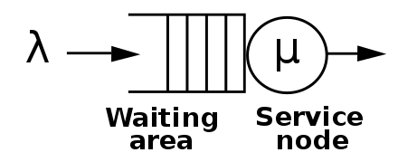
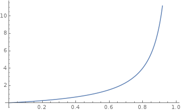
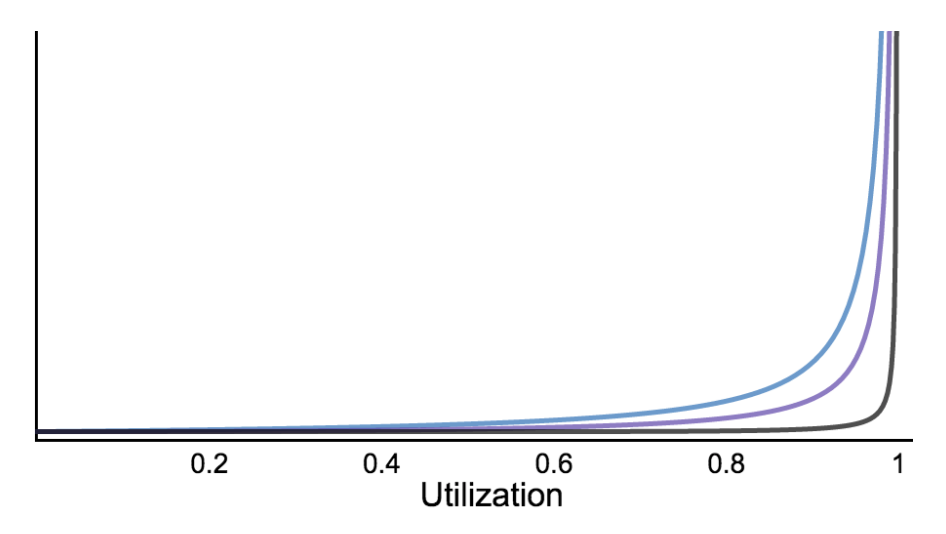
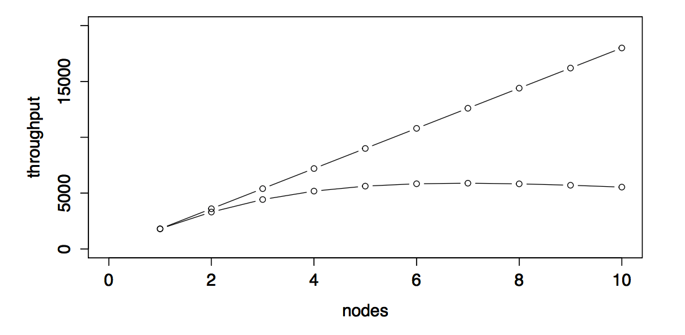
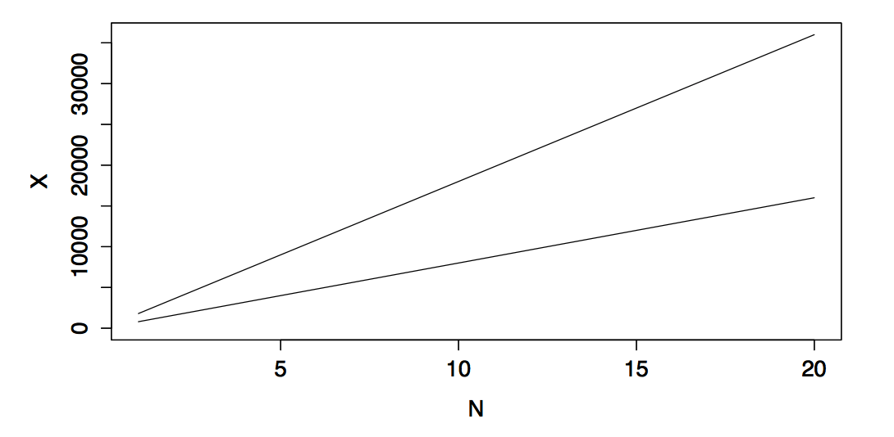
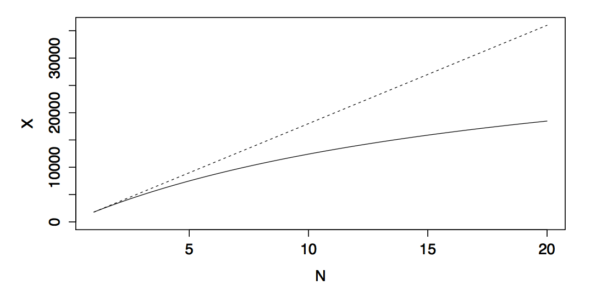
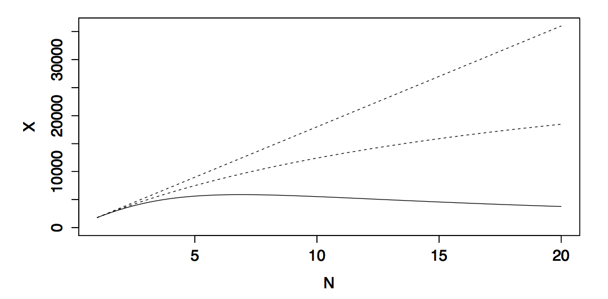

# Queueing Theory

Brice Figureau - Asmodee Digital - 2017

---

## Definition

--

## Definition

> Queueing theory is the mathematical study of waiting lines.

--

## History

Agner Krarup Erlang designed models to describe the Copenhagen telephone exchange in 1909.

---

# There are queues everywhere !

--

## in life
* toilets in the morning
* traffic jam
* banks, post office
* restaurant
* even at work!
...

note: for instance at work: work in progress is a queue that
you want to minimize

--

## or in computer systems
* RAM / CPU
* routers
* kernels
* software
...

--

## Queueing happens everywhere.

## Waiting time is lost time.

---

## Why would you want to study that ?

* systems get congested under load (traffic jams?)
* waiting time increases
* queueing theory allows understanding relationships between congestion and delay
* capacity planning
* performance analysis

---

## Models

Queueing theory proposes models based on some assumptions, if your system verifies those assumptions you can predict the queues behaviors and now the system limits.

It allows to simulate behaviors by changing the queue model.

---

## Little's Theorem

$$L = \lambda W$$

* L is the average number of customers or events in the queuing system
* λ is the average customer or event arrival rate
* W is the average service time for the customer or event processing time

note: restaurant: double the number of customer arriving, you get double of customers in the restaurant
same if you double the service time. Applies only to steady systems and to averages.

---

# What's in a queue ?

--

## Queueing discipline

aka how do you serve the clients

* FIFO
* LIFO
* Priority
* Loop

note: we're focusing only on FIFO

--

## Arrival distribution

* random arrival over long periods
* customers arrival independent of other
* count the arrival per time slot
* distribution: histogram of arrival frequency
* this is the Probability Mass Function

--

## Arrival distribution (supermarket)

* count number of arrivals per 5 min slots
* count number of occurences we had for 0, 1, 2... customers
* relative frequency: 
$$ A_n / Total $$

note: 
count arrival of customers per 5 min slots
count the number of times it happened for 0 cust, 1 cust, ...
compute relative frequency

--

## Arrival distribution (supermarket)

| Arrivals | number | relative freq |
|----------|--------|---------------|
|    0     |  255   |    47%        |
|    1     |  190   |    35%        |
|    2     |   72   |    13%        |
|    3     |   19   |     4%        |
|    4     |    3   |     1%        |
|  total   |  539   |   100%        |

--

## Arrival distribution (supermarket)

$$ \lambda = 0x47\% + 1x35\% + 2x13\% + 3x4\% + 4x1\% = 0.74768 $$

This forms a _Poisson distribution_ (like most random phenomenon)

$$P(x) = \frac{\lambda_x e^{-\lambda}}{x!} , x=0,1,2...$$

$$P(0) = \frac{1 e^{-0.75}}{1} = e^{-0.75} = 0.47$$ 
$$P(0) = \frac{0.75 e^{-0.75}}{1} = 0.75 e^{-0.75} = 0.35$$ 
...

note: This also is called a Markovian distribution

--

## Service time distribution

Same kind of analysis (except we measure the time spent to serve a client) as the Arrival distribution, if random an Exponential distribution applies.

---

## Kendall Classification

* suggested by David Georges Kendall in 1957
* simplest form: a/b/c

with

* a: probability distribution of arrival
* b: probability distribution of service time
* c: number of servers

--

## Kendall Classification

* M: Poisson distribution (arrival) or Exponential (service time)
* E: Erlang distribution
* D: Constant distribution
* G: General distribution (with known mean/variance)

--

## Kendall

* M/M/1 -> Poisson, Exponential 1 server
* M/M/2 -> 2 servers
* M/D/3 -> constant service time, 3 servers

note:
complex form adds 2 parameters total capacity and total population
assumed infinite in simplest form

---

## Infinite Queues ?

* λ: arrival rate (client/unit of time)
* µ: processing rate (client/unit of time)
* λ / µ < 1 -> finite queue
* λ / µ > 1 -> need an inifinite: bad!

---

## M/M/1

* most used/simple model
* Poisson: 
  * assumes large number of clients
  * impact of one client small on the system
  * indepence of clients

--

## M/M/1 the gory details

given λ and µ (=1/S)

Utilization (% of use)
$$ \rho = \frac{\lambda}{\mu} $$

note: I'm won't do any demonstration but all those formulas can be demonstrated
with probabilities (see Erlang 1917 paper)

--

## M/M/1 the gory details

Average time in waiting line:
$$ W = \frac{\rho S}{1 - \rho} $$

Average residence time:
$$ R = W + S = \frac{S}{1 - \rho} = \frac{1}{\mu - \lambda} $$

--

## M/M/1 the gory details

Average number of customers in waiting line:
$$ L = \lambda W = \frac{\rho^2}{1 - \rho} $$

Average number of customers in system:
$$ Q = \lambda R = \frac{\rho}{1 - \rho} $$

--

## M/M/1 the gory details

Probability of no customers:

$$ P_0 = 1 - \frac{\lambda}{\mu} $$

Probability of a \# *n* of customers

$$ P_n = \rho^n P_0 $$

--

## M/M/1 conclusion

(normalized) residence time proportional to 

$$ \frac{1}{1 - \rho}$$

note: at high utilization, waiting times become
 asymptotical ! Clearly we need to keep the system
 under optimal utilization.

---

## M/M/c

Much more complex, based on Erlanc C formula

Probability that a customer has to enter a queue
$$ C(c,\rho) = \frac{1}{1 + (1 - \rho)(\frac{c!}{(c \rho)^c})(\sum_{k=0}^{c-1} \frac{(c \rho)^k}{k!})} $$

\\(c \rho\\) = traffic intensity mesured in Erlangs

Average number of customers in system:
$$ L = \frac{\rho}{1 - \rho} C(c,\rho) + c \rho $$

note: C equation requires iterative computations - can't be computed in Excel 
it's also not intuitive (can't derive any information if c increases/decreases)
Erlang is a measure of load (number of call active at a moment in a telephone system)

--

## M/M/c

We need approximations !

Hirotaka Sakasegawa 1977 approximation

$$ L\_q \approx \frac{\rho \sqrt{2(c + 1)}}{1 - \rho} $$

note:
increase rho -> increase in q time
increase c -> decrease of q time 

--

## M/M/c

Gunther's approximation:

$$ L\_q \approx \rho c (\frac{1}{1 - \rho^c} - 1) $$

--

## M/M/c

|servers | utilization  | Erlang C  | Sakasegawa | Gunther   |
|--------|------------- |-----------|------------|-----------|
|    1   |     0.500    | 0.500000  |  0.500000  | 0.500000  |
|    2   |     0.500    | 0.333333  | 0.333333   | 0.366151  |
|    2   |     0.999    | 997.50175 |  997.50175 | 997.552285|
|    8   |     0.500    | 0.059044  |  0.015686  | 0.105650  |
|    8   |     0.999    | 995.760755|  994.509747| 995.764233|
|   64   |     0.999    | 989.334082|  966.873556| 988.657359|

--

## Utilization per \# of servers

note:
different server count=1, 2, 16
this has an impact -> more concurrency can use system at higher utilization

---

## Combined or Separate ?

Airport checking with 2xM/M/1 or an M/M/2 with 240 passengers/hour with a service time of 15s per passenger:

| Metric       | Combined | Separate |
|------------- |----------|----------|
| Utilization  |   50%    |   50%    |
| Avg Q Length |   0.33   |   0.5    |
| Avg W        |   20s    |   30s    |

--

## Combined or Separate ?

4 times more passengers, adding 4 servers

| Metric       | Combined | Separate |
|------------- |----------|----------|
| Utilization  |   50%    |   50%    |
| Avg Q Length |   0.06   |   0.5    |
| Avg W        |   15.24s |   30s    |

---

##  Conclusion?

* There are queues everywhere
* we add queues to improve availability, utilisation and throughput but it costs latency/time/money
* Helps build better intuition about effecting variables
* Understand variables relationship (Little's linear Law, non-linear variables)

---

# BUT

--

## But

* those models don't apply to all systems (not all processes are Markovian)
* complex for networks of queues (ie computers, distributed systems etc) <!-- .element: class="fragment" -->
* closed queues are a different world (machine repairman model) <!-- .element: class="fragment" -->

note:
for instance M/M/c can't be used to predict end-to-end traffic as adding travel time makes it non markovian.

--

### ... and nobody expects the

# Universal Scalability Law <!-- .element: class="fragment" -->

--

## Definition

Andre B. Bondi:
> the capability of a system, network, or process to handle a growing amount of work, or its potential to be enlarged in order to accommodate that growth

note:
quite informal

--

## Definition

Neil Ghunther:
> Scalability can be defined as a mathematical function, a relationship between independent and dependent variables (input and output).

note:
a function whose inputs is size/load and output is throughput

--

## Some elements of this function

* requests
* arrival rate
* concurrency
* number of clients

note:
some of those elements are dependent, some might be independent of other elements

--

# There is no such thing as linear scalability

note:
you can add more resource, it will give a boost, but nothing tells the system scale linearly

--

### There is no such thing as linear scalability

--

## Why ?

* system loose efficiency when growing, can even exhibit retrograde scalability
* contention: queues form because not everything can happen in parallel
* crosstalk: coherency penalty lost when parts has to synchronize or exchange information

note:
contention: think RAM access in multi-cpu, or specialized workers in team
crosstalk: think threads, cpu, host in a distributed system
happens also to people in teams

--

### USL: the ideal case

$$ X(N) = \frac{\lambda N}{1} $$

note:
N: number of nodes/workers, etc
double N, it doubles the throughput.
λ is the coefficient of performance (slope of linear scalability)

--

### USL: adding contention penalty

Amdahl’s Law:

$$ X(N) = \frac{\lambda N}{1 + \sigma (N -1)} $$

note:
Contention increase with parallelism
Amdahl's Law: the maximum speedup possible is the reciprocal of the
non-parallelizable portion of the work
sigma: coefficient of contention

--

### USL: adding crosstalk penalty

$$ X(N) = \frac{\lambda N}{1 + \sigma (N -1) + \kappa N (N - 1)} $$

note:
crosstalk happens between 2 components of a system, there are n(n-1) relationships
possible in a system.
The crosstalk penalty grows fast: quadratic! even with small kappa, it will outgrow the linear part

in graphs 1 node system produces: 1800 TPS (lambda)

5% contention
2% crosstalk

at 4 nodes -> 72% of ideal throughput

--

### USL: tipping point

$$ N_{max} = \lfloor \sqrt{\frac{1 - \sigma}{\kappa}} \rfloor $$

note:
max concurrency exhibiting the max throughput

--

## Relationships to Queueing Theory ?

* USL demonstrated to map to machine repairman model (closed queues)
* contention adds queueing delay on access to shared resources 
* crosstalk increases service time

note:
* remember queueing delay (and length, Little Law) is non linear function uf utilisation
* crosstalk: service time increases but not due to queueing delay
* QT assumes service time not dependent of concurrency or load
* QT can explain retrograde scalability

--

## How to use the USL ?

* capture system throughput at various load
* retrofit to the USL, get lambda, sigma, kappa
* then get the max throughput the system can have

--

## What about latency ?

* system performance = throughput (what we care about)
* request performance = latency (what client cares about)
* Little's law allows to solve for latency

$$ R(N) = \frac{1 + \sigma (N - 1) + \kappa N (N - 1)}{\lambda} $$

note:
relationship between throughput and latency
response time follows the square of concurrency!

--

## Use

* predict system maximum throughput for a given latency
* capacity planning (USL best case scenario)
* improve system scalability (why is this system degrading much more than USL ?)

note:
USL is just a macro model, might not work for everything (ie some systems are superlinear)
USL can't see everything (ie network capacity)

--

## Summary

* Better know Lille's Law
* QT is hard and not intuitive
* Residence time/queue length asymptotical (hockey stick)
* USL math is intuitive -> capacity planning
* USL black-box analysis friendly
* USL can explain system sub-performance (too much queueing, too much crosstalk)

---

References:

http://people.revoledu.com/kardi/tutorial/Queuing/Queuing-What-Is.html
http://irh.inf.unideb.hu/~jsztrik/education/16/SOR_Main_Angol.pdf
https://github.com/VividCortex/approx-queueing-theory
https://speakerdeck.com/drqz/m-a-new-view-of-an-old-queue
https://www.slideshare.net/vividcortex/quantifying-scalability-with-the-usl
https://github.com/VividCortex/approx-queueing-theory/blob/master/sakasegawa-1977.pdf
http://www.perfdynamics.com/Manifesto/USLscalability.html

